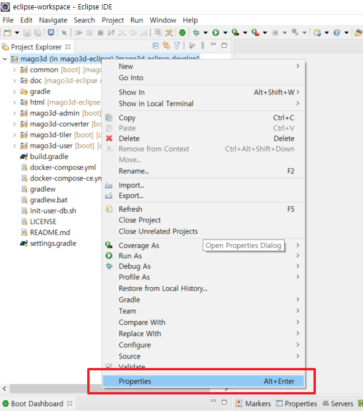
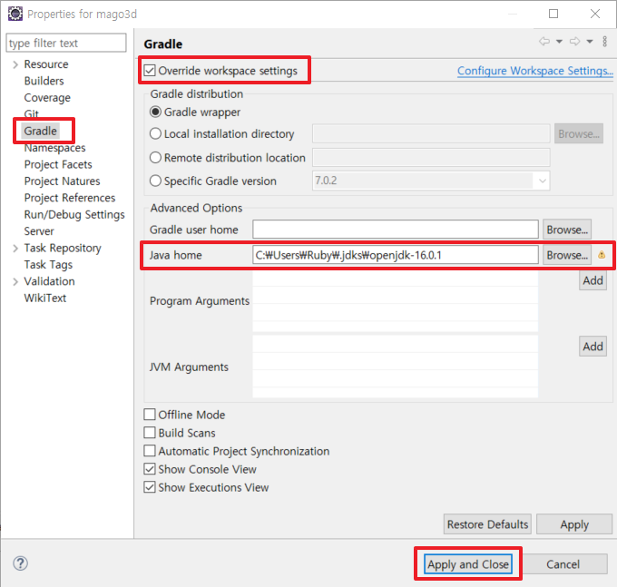

# MAGO3D 프로젝트

## 1. 프로젝트 버전
* openjdk 16
* postgres 13.3
* gradle7
* spring boot 2.5

## 2. 이클립스 최신 버전에서 세팅
### 1. openjdk16을 인식하지 못함
openjdk16을 인식하지 못해서, market place 에서 plugin 설치 해 줘야 함.

[이클립스 마켓플레이스 이슈링크](https://marketplace.eclipse.org/content/java-16-support-eclipse-2021-03-419)
[이클립스 플러그인 설치 링크](https://download.eclipse.org/eclipse/updates/4.19-P-builds/)

### 2. gradle jdk 설정
gradle task 가 jdk를 인식하지 못해서 wrapper 가 아닌 gradle 설정에서 jdk를 명시적으로 지정해 줘야 함.




### 3. geotools 라이브러리 문제
* geotools 관련 repository 가 다운이 안되서 수동으로 넣어 둠.
* 라이브러리 위치 : mago3d-admin/libs

TODO : 관리자 레이어 기능에서 테스트 해 봐야 함. 현재는 빌드는 되는데 기능에서 오류가 남. 레이어 관련 모든 기능을 테스트 해 봐야 함.

## 3. 서비스 Run 이후 발생한 오류 해결

### 1. BeanDefinitionOverrideException 에러

#### - 에러 메세지
org.springframework.beans.factory.support.BeanDefinitionOverrideException: Invalid bean definition with name 'localeResolver' defined in class path resource 
`[gaia3d/config/ServletConfig.class]`: Cannot register bean definition
The bean 'localeResolver', defined in class path resource `[gaia3d/config/ServletConfig.class]`, could not be registered. 
A bean with that name has already been defined in class path resource `[org/springframework/web/servlet/config/annotation/DelegatingWebMvcConfiguration.class]` 
and overriding is disabled.Action:Consider renaming one of the beans or enabling overriding by setting spring.main.allow-bean-definition-overriding=true

#### - 원인 분석
DelegatingWebMvcConfiguration.class -> WebMvcConfigurationSupport.class (1181 ~ 1184 lines)
WebMvcConfigurationSupport 클래스에 이미 LocaleResolver 빈이 localeResolver으로 설정되어서 발생한 오류.
spring boot 2.5에서 추가된 것으로 판단.

```
// WebMvcConfigurationSupport.class
@Bean
public LocaleResolver localeResolver() {
   return new AcceptHeaderLocaleResolver();
}
```

```
// ServletConfig.class
@Bean
public LocaleResolver localeResolver() {
   return new SessionLocaleResolver();
}
```
#### - 해결 방법
ServletConfig에서 LocaleResolver 빈 설정을 주석처리하는 것으로 해결.

### 2. IllegalStateException 에러

#### - 에러 메세지
Unable to locate the default servlet for serving static content. 
Please set the 'defaultServletName' property explicitly.

#### - 원인 분석
[stackoverflow 참고링크](https://stackoverflow.com/questions/64822250/illegalstateexception-after-upgrading-web-app-to-spring-boot-2-4)

스프링 부트 2.4 릴리즈 노트 설정에 의하면, 내장된 서블릿 컨네이너에 의해 제공되던 `DefaultServlet`이 더 이상 기본으로 등록되지 않는다.
만일, 어플리케이션에 필요하다면 server.servlet.register-default-servlet을 true로 설정하면 된다.

>As described in the Spring Boot 2.4 release notes, the DefaultServlet provided by the embedded Servlet container is no longer registered by default.
If your application needs it, as yours appears to do, you can enable it by setting server.servlet.register-default-servlet to true.

또는, `WebServerFactoryCustomizer` 빈을 프로그래밍 방식으로 설정할 수 있다.
>Alternatively, you can configure it programatically using a `WebServerFactoryCustomizer` bean:

```
@Bean
WebServerFactoryCustomizer<ConfigurableServletWebServerFactory> enableDefaultServlet() {
    return (factory) -> factory.setRegisterDefaultServlet(true);
}
```
#### - 해결 방법
`application.properties`에 `server.servlet.register-default-servlet=true` 설정을 추가하는 것으로 해결.
