# 목차 
1. [Java](#1-java)
2. [PostgreSQL/PostGIS](#2-postgresqlpostgis)
3. [GDAL](#3-gdal)
4. [GeoServer](#4-geoserver)
5. [F4D Converter](#5-f4d-converter)
6. [RabbitMQ](#6-rabbitmq)
7. [기본-테이블-생성-및-패스워드-업데이트](#7-기본-테이블-생성-및-패스워드-업데이트)
8. [설정](#8-설정)
9. [레이어-업로드-테스트](#9-레이어-업로드-테스트)
10. [3D-데이터-업로드-테스트](#10-3d-데이터-업로드-테스트)

## 1. Java
### 1) Java 설치

- 자바설치 홈페이지(https://jdk.java.net/archive/)에 접속하여 Java를 구동하기 위한 환경에 해당하는 파일을 내려받는다.
- 내려 받은 압축 파일을 설치할 폴더에 압축 해제한다.


### 2) Java 환경변수 설정

- [제어판] → [시스템 및 보안] → [시스템] 또는 [내 PC]의 [속성]을 클릭 한 후, [고급 시스템 설정]을 클릭한다.

- [시스템 속성]의 [고급]탭 화면에서 [환경 변수]를 클릭한다.

- [환경변수] 화면에서 [새로 만들기]를 클릭하여, 변수 이름과 변수 값 입력란에 **JAVA_HOME**과 Java의 경로를 설정한다.
- Java 설치 경로를 설정 한 후, **시스템 변수의 [Path] 변수**를 선택하고 [편집] 버튼을 클릭한다.
- 제일 앞쪽에 **%JAVA_HOME%\bin;**을 입력하고 저장한다.

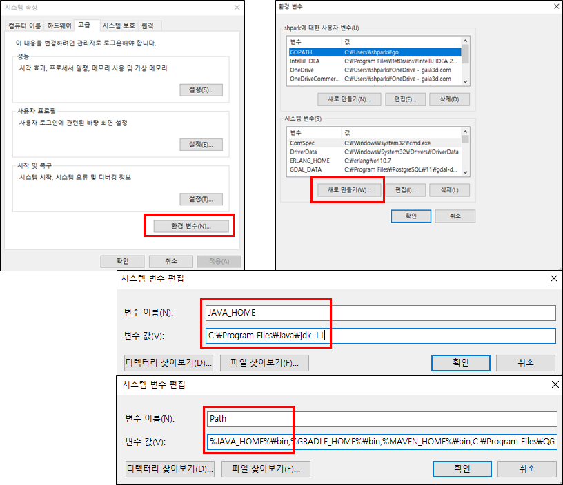

 

### 3) Java 설치 확인

- 명령 프롬프트 창을 실행시켜 아래와 같이 명령어 실행

```
1java -version
```


## 2. PostgreSQL/PostGIS
### 1) PostgreSQL 설치

- PostgreSQL 홈페이지(https://www.postgresql.org/)에 접속하여, Windows용 설치 파일을 내려 받는다 (https://www.enterprisedb.com/downloads/postgres-postgresql-downloads)


- 내려 받은 파일을 실행하여, PostgreSQL을 설치한다.

- 폴더 버튼을 클릭하고 설치 할 경로를 지정한다.
- 설치 항목에 Stack Builder 는 선택하지 않는다. 

- Password와 Retype password를 “postgres”로 설정한다.

- 포트(5432) 및 지역(Korea)을 설정한다.

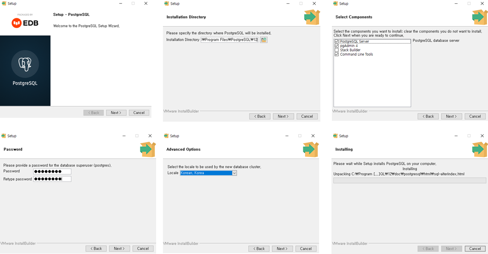

 

### 2) PostGIS 설치

- postGIS 설치 방법으로는 postgresql 설치 후 stack builder를 통해 설치 하거나 직접 인스톨러를 실행하는 방법이 있는데 후자로 진행하도록 한다. stack builder를 통한 설치는 종종 오류가 발생하고 인터넷이 되지 않는 환경을 고려했을 때는 인스톨러를 통한 설치가 안전하다. ([http://download.osgeo.org/postgis/windows/pg12/](http://download.osgeo.org/postgis/windows/pg11/))
- 여기서는 [postgis-bundle-pg12x64-setup-3.0.2-1.exe](http://download.osgeo.org/postgis/windows/pg12/postgis-bundle-pg12x64-setup-3.0.2-1.exe) 버전을 다운받는다.
- 내려 받기가 완료되면 PostGIS 설치를 진행할 수 있다.

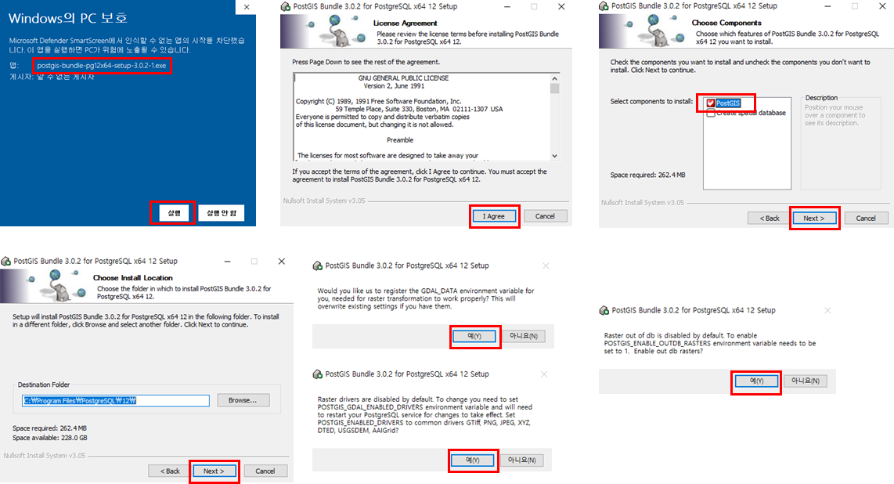

### 3) PostgreSQL 설정

- 파티션 설정을 위해서 postgresql.conf 설정 파일의 “enable_partition_pruning = on”의 주석을 해제한다. 

- postgresql.conf 파일은 윈도우 기준으로 기본으로 설치시 **C:\Program Files\PostgreSQL\12\data** 경로에 위치하며, 설정파일 수정후에는 postgresql 서비스를 재시작해야한다.

  

   

### 4) 데이터 베이스 생성

- psql 또는 PgAdmin을 사용하여 데이터베이스에 연결한 후, 아래와 같이 데이터베이스를 생성한다.

  ```
  CREATE DATABASE mago3d
  WITH OWNER = postgres
       ENCODING = 'UTF8'
       TEMPLATE = template0
       TABLESPACE = pg_default
       LC_COLLATE = 'C'
       LC_CTYPE = 'C'
       CONNECTION LIMIT = -1;
  ```

### 5) PostGIS 활성화

- psql 또는 PgAdmin을 사용하여 생성한 데이터베이스에 연결한 후, 다음 SQL을 실행한다.

  ```
  CREATE EXTENSION postgis;
  ```

- PostGIS 설치 확인
  ```
  SELECT postgis_version();
  ```
## 3. GDAL
### 1) GDAL 설치

- gdal을 설치하는 이유는 shape 파일을 db에 insert할 때 ogr2ogr을 사용하기 위함인데, gdal만 단독으로 설치하거나 qgis를 설치하여 gdal path를 잡아주는 방법이 있다.

- GDAL을 설치하기 위해 홈페이지(https://trac.osgeo.org/osgeo4w/)에 접속한다.

- Download the [32bit] 0r [64bit]에서 [64bit]를 선택하여 해당 파일을 내려 받는다.

  )

   

- 내려 받은 파일을 실행하여, 아래와 같은 설치 창이 생성된다.

- GDAL을 제외한 QGIS/GRASS GIS는 필요하면 체크하여도 무관하다.


### 2) GDAL 환경변수 설정

- [제어판] → [시스템 및 보안] → [시스템] 또는 [내 PC]의 [속성]을 클릭 한 후, [고급 시스템 설정]을 클릭한다.

- [시스템 속성]의 [고급]탭 화면에서 [환경 변수]를 클릭한다.
- **사용자 변수의 [Path] 변수**를 선택하고 [편집] 버튼을 클릭한다.

- [새로 만들기] 버튼을 클릭하여, **C:\OSGeo4W64\bin;**을 추가한다.
- **QGIS를 설치 후 환경변수를 추가할때는 qgis\bin 경로를 추가한다.**

### 3) GDAL 설치 확인

- 명령 프롬프트 창을 실행시켜 아래와 같이 명령어 실행하여 ogr2ogr 이 정상적으로 환경 변수로 등록되었는지 확인한다.

  ```
  ogr2ogr
  ```

  

- **환경변수를 등록한 후에는 was가 실행중이라면 재기동해야 등록한 환경변수가 적용되므로 주의해야한다. cmd 창역시 환경변수를 등록후에는 새로운 cmd 창에서 확인하도록 한다.**


## 4. GeoServer
### 1) GeoServer 설치

- GeoServer 홈페이지(http://geoserver.org/release/maintain/)에 접속하여, Tomcat에 war형태로 올려서 서비스하기 위해 Web Archive 버전을 내려 받는다.
- 내려받은 파일을 압축해제 후, geoserver.war파일을 톰캣의 webapp밑에 압축을 해제한다.

### 2) WPS Extensions

- GeoServer 버전에 맞는 플러그인을 내려 받는다.

https://sourceforge.net/projects/geoserver/files/GeoServer/2.16.4/extensions/geoserver-2.16.4-wps-plugin.zip/download

- gs-web-wps-2.16.4.jar

- gs-wps-core-2.16.4.jar

- gs-process-geometry-22.4.jar

- gt-xsd-wps-22.4.jar

- net.opengis.wps-22.4.jar

- serializer-2.7.2.jar

- 압축을 풀고, .jar 파일들을 Geoserer의 WEB-INF/lib 폴더에 복사하여 붙여 넣는다.

- GeoServer 재시작 후, 서비스 항목에 WPS 확인한다.

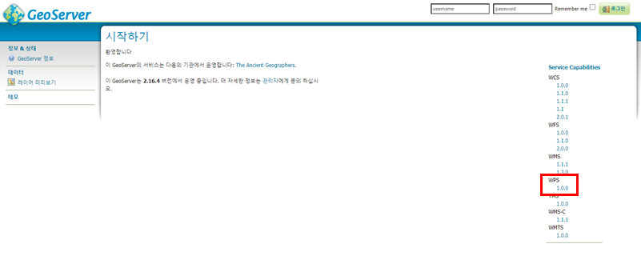

### 3) OpenGXT + GeoTools Extentions

- GeoServer 버전에 맞는 플러그인을 내려 받는다.

https://sourceforge.net/projects/mango-spatialstatistics/files/GeoServer/

- gs-wps-spatialstatistics-2.16-SNAPSHOT.jar

- gt-process-spatialstatistics-22-SNAPSHOT.jar

- 압축을 풀고, .jar 파일들을 Geoserer의 WEB-INF/lib 폴더에 복사하여 붙여 넣는다.

- GeoServer 재시작 후, 바인딩된 WPS 프로세스 확인

- GeoServer 관리자 페이지 → 데모 → WPS 요청 빌더

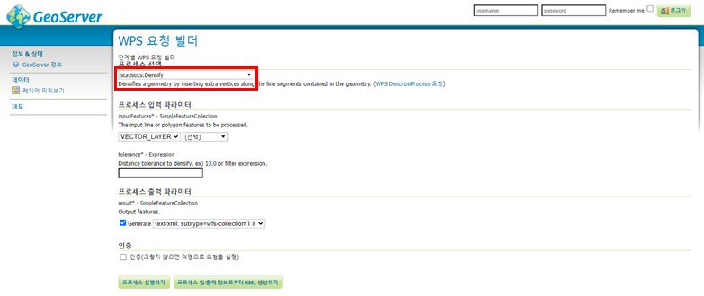

 

### 4) CORS 설정

- 톰캣의 web.xml에 다음과 같이 설정한다.

  ```
  <filter>
      <filter-name>CorsFilter</filter-name>
      <filter-class>org.apache.catalina.filters.CorsFilter</filter-class>
      <init-param>
          <param-name>cors.allowed.origins</param-name>
          <param-value>*</param-value>
      </init-param>
      <init-param>
          <param-name>cors.allowed.methods</param-name>
          <param-value>GET,POST,HEAD,OPTIONS,PUT</param-value>
      </init-param>
      <init-param>
          <param-name>cors.allowed.headers</param-name>
          <param-value>*</param-value>
      </init-param>
      <init-param>
          <param-name>cors.exposed.headers</param-name>
          <param-value>Access-Control-Allow-Origin,Access-Control-Allow-Credentials</param-value>
      </init-param>
      <init-param>
          <param-name>cors.preflight.maxage</param-name>
          <param-value>10</param-value>
      </init-param>
    </filter>
  ```

### 5) 작업공간 및 저장소 생성

- GeoServer 관리자 페이지 → 데이터/작업공간 → **새로운 작업공간 추가하기**

```
이름 : mago3d
네임스페이스 URI : http://www.gaia3d.com
기본 작업공간으로 설정하기 체크
```

- GeoServer 관리자 페이지 → 데이터/저장소 → 새로운 저장소 생성하기 → PostGIS

- postgresql 설치 후 생성한 database정보를 적어주는데 postgis extension을 설치하지 않으면 저장소 등록이 되지 않으므로 꼭 생성한 db에 posgis extension을 설치해야 한다.

  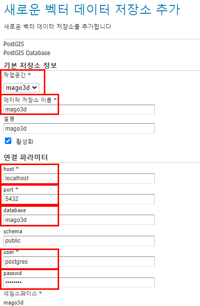
## 5. F4D Converter
- 아래의 링크를 통해서, Converter를 내려 받는다.

[F4DConverter/SetupF4DConverter.msi at master · Gaia3D/F4DConverter](https://github.com/Gaia3D/F4DConverter/tree/master/install) 

- **설치경로 : C:\F4DConverterConsole**

- 내려 받은 파일을 실행하여, Converter를 설치한다.

  
## 6. RabbitMQ
- RabbitMQ란 표준 MQ 프로토콜인 AMOP(Advanced Message Queueing Protocol)의 메시지 브로커 소프트웨어 오픈소스이다.

- RabbitMQ는 처리가 빠르다는 장점이 있으나, Erlang 의존성이 있기 때문에 설치에 앞서 Erlang/OTP를 필수적으로 설치해야 한다. RabbitMQ 버전별 Erlang 버전은 RabbitMQ 홈페이지[(https://www.rabbitmq.com/which-erlang.html](https://www.rabbitmq.com/which-erlang.html))에서 확인할 수 있다.

### 1) Erlang 설치

- rabbit mq 를 설치하기 위해서는 erlang 이 필요하기 때문에 먼저 erlang를 설치하도록 한다.

- Erlang 홈페이지(https://www.erlang.org/downloads)에 접속하여, Download OTP 23.0 항목에서 ‘OTP 23.0 Windows 64-bit Binary File’을 클릭하여 파일을 내려 받는다.

  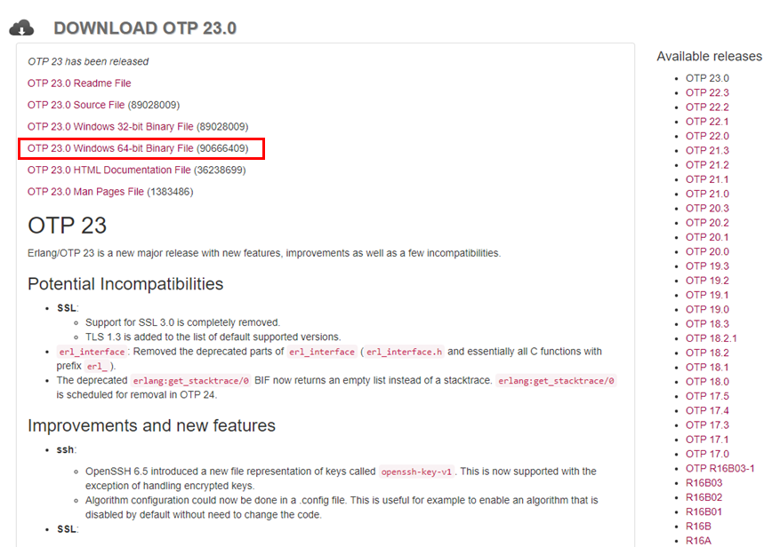

   

- 내려 받은 파일을 실행한다.

- 구성요소 설정은 기본값으로 할 것이므로 next를 클릭한다.

- 설치 경로는 erlang 버전 관리를 용이하게 하고자 **‘C:\erlang\otp_22.2\erl10.6’** 으로 설정한다.

- 설치 버튼을 클릭한다.

- Visual C++ 구성요소 설치 창이 뜰 경우 체크박스를 체크하고 설치한다.

### 2) RabbitMQ 설치

- RabbitMQ 홈페이지(https://www.rabbitmq.com/download.html)에 접속하여, 최신 버전(RabbitMQ 3.8.7)을 확인하고 운영체제 환경에 맞춰 설치 파일을 내려 받는다.
- 기본 설정으로 설정하고 Next를 클릭한다.

- 경로는 **‘C:\RabbitMQ\’**로 설정하고, Install을 클릭하여 설치를 진행한다.

- 설치가 완료된 것을 확인하고, next를 클릭한다.

- 작업이 끝난 것이 확인되면 Finish 버튼을 클릭하여 창을 닫는다.

 

### 3) RabbitMQ 환경변수 설정

- [제어판] → [시스템 및 보안] → [시스템] 또는 [내 PC]의 [속성]을 클릭 한 후, [고급 시스템 설정]을 클릭한다.

- [시스템 속성]의 [고급]탭 화면에서 [환경 변수]를 클릭한다.

- [환경변수] 화면에서 [새로 만들기]를 클릭하여, 변수 이름과 변수 값 입력란에 **RABBITMQ_HOME**과 RabbitMQ 설치 경로를 설정한다.
- RabbitMQ 설치 경로를 설정 한 후, **시스템 변수의 [Path] 변수**를 선택하고 [편집] 버튼을 클릭한다.
- [새로 만들기] 버튼을 클릭하여, **%RABBITMQ_HOME%\sbin** 을 입력한다.

### 4) RabbitMQ 관리자페이지([http://localhost:15672](http://localhost:15672/)) 접속

- 관리자 페이지에 접속하기 위해서는 management plugin이 활성화 되어야 한다. (비활성화 시 접속 불가)
- RabbitMQ의 management plugin을 활성화하기 위해 명령 프롬프트 창에 ‘**rabbitmq-plugins enable rabbitmq_management**’라고 입력하여 활성화한다.
- 명령 프롬프트를 재시작하고, ‘**rabbitmq-plugins list**’로 플러그인의 활성화 여부를 확인한다.

### 5) RabbitMQ 관리자 설정

- RabbitMQ 관리자 페이지([http://localhost:15672](http://localhost:15672/))에 접속한다.
- 아이디와 비밀번호는 모두 guest로 로그인한다.

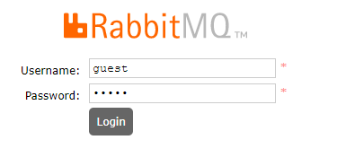

- 상단에 Exchange 탭을 클릭한다.

- 하단에 Add a new exchanges를 클릭하여 우측 그림과 같이 입력한 뒤, Add exchange 버튼을 클릭한다.

  - *Name : f4d.converter*
  - *Type : topic*
  - *Durability : Durable*

  

- 상단에 Queues 탭을 클릭한다.

- 하단에 Add a new queue를 클릭하여 우측 그림과 같이 입력한 뒤, Add queue 버튼을 클릭한다.

  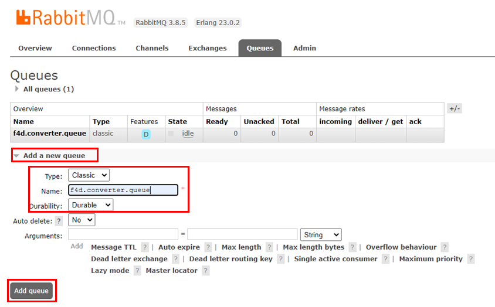

- RabbitMQ를 처음 설치하면 guest 계정이 Administrator로 권한 설정되어 있다. 하지만 이 계정으로 application에 접속할 시, 접속 관련 오류가 발생한다.

- 다른 관리자 계정을 생성하기 위해 Admin 메뉴 하단의 Add a user를 클릭하고 우측 그림과 같이 입력하여 관리자 계정을 생성한다. (아이디와 비밀번호는 동일하다.)

  - Username : mago3d

  - Password : mago3d 

    

   
- guest 아래에 새로 생성된 mago3d계정을 클릭한다.

- 아래 화면과 같이 Current permissions, Current topic permissions을 생성하고 Update this user에 비밀번호(mago3d)를 입력한 뒤, 하단의 Update user 버튼을 클릭한다.

  
  
## 7. 기본 테이블 생성 및 패스워드 업데이트
### 1) SQL 실행

- mago3d 프로젝트 내 doc 폴더에서 [database] – [ddl] 폴더와 [dml] 폴더에서 sequence 폴더부터 dml 폴더 안의 update.sql까지 순서대로 실행한다.
- **단 reference.sql, delete.sql 은 제외(참조키 관련내용은 실행하지 않는다.)**
- **프로젝트의 브런치는 develop이 아닌 mago3d 브런치를 사용하도록 한다.**
- pgAdmin4를 사용할 경우 실행할 sql 파일들을 선택후 드래그하여 한번에 실행할 수 있다.

### 2) mago3d-web application 계정 비밀번호 설정

- [mago3d-admin] – [src/test/java] – gaia3d– units – passwordTest.java 파일을 Junit Test로 실행한다.

- Console창에 뜬 encodePassword 값을 복사하여 pgAdmin의 Query Editor에서 update문(update user_info set password = ‘(encodePassword 값)’ where user_id=＇admin’; )으로 admin의 비밀번호 값을 변경한다. mago3d 계정도 동일한 방식으로 변경한다.

  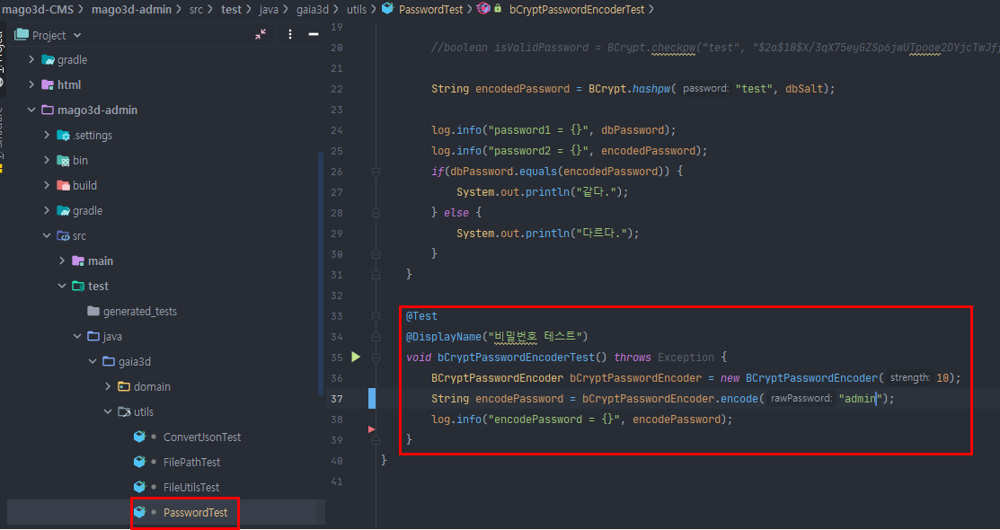

   
## 8. 설정
### 1) mago3d.properties 파일 경로 생성 

- 어플리케이션에서 사용하는 폴더들을 생성해준다. 
  - mago3d-admin - src - main - resources - mago3d.properties
  - mago3d-user - src - main - resources - mago3d.properties
  - mago3d-converter - src - main - resources - mago3d.properties

### 2) datasource url 설정 

- 현재 개발중인 mago3d 프로젝트는 datasource port를 15432 를 사용하고 있으므로, 설치한 postgresql 의 port 를 15432로 변경하거나 아래의 과정처럼 테스트 코드를 실행하여 암호화된 값으로 각 프로젝트의 application.properties 파일의 datasource url 을 변경해주도록 한다. 

  - 암호화를 위한 테스트 코드 경로 : common - src - test - java -gaia3d - security - CryptTest

  - mago3d-admin - src - main - resources - application.properties

  - mago3d-user - src - main - resources - application.properties

    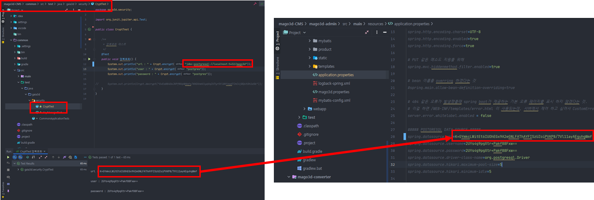

- 만약 postgresql 의 port를 15432로 변경할 경우 geoserver 의 postGIS 저장소의 port 도 동일하게 15432로 수정해야 한다. 
## 9. 레이어 업로드 테스트
- Vector 레이어 등록

  

  - 레이어 등록 기능은 geoserver를 통해 이루어지기 때문에 환경설정 - 공간정보 운영정책 - **GeoServer 탭에서 데이터URL 의 geoserver 가 기동중이어야 하고, 작업공간과 저장소가 만들어져 있어야 한다.**

    

  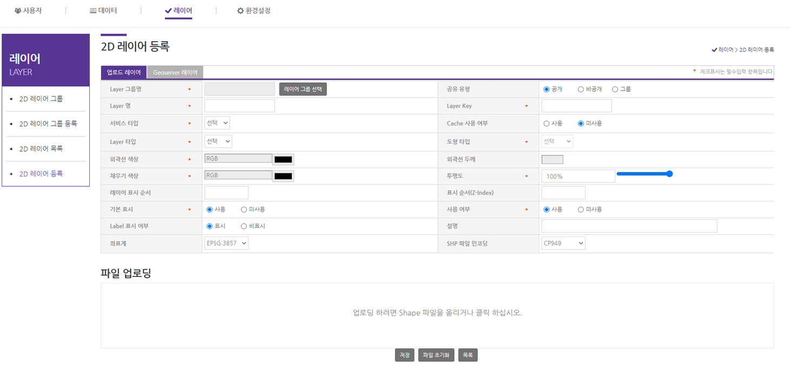

   

  - Vector 레이어 등록은 SHP 파일을 지원한다. 
    - 스타일 수정 : 투명도, 외곽선 두께, 외곽선/채우기 색상을 지원한다.
    - 레이어 표시 순서 및 Z-index 수정 : 레이어 표시 순서는 사용자 사이트에서 레이어 목록에 보여지는 순서이며, 값이 클수록 하단에 보여진다. Z-index 는 레이어의 겹침 순서를 뜻한다.   

- Raster 레이어 등록 

  


  - SHP 파일에 비해 용량이 큰 Raster 데이터에 대해서는 파일 업로드를 지원하지 않고 geoserver 에 등록된 레이어 목록중에서 선택해서 서비스 할 수 있는 기능을 지원한다. 

- Cache 설정 : WMS 서비스의 경우 Cache 사용 여부가 **사용**일 경우 geowebcache 를 사용하여 캐시된 데이터를 서비스 하고 **미사용** 일경우 일반 WMS 서비스를 사용한다.

## 10. 3D 데이터 업로드 테스트
- 데이터 업로드를 테스트는 mago3d-user 를 IDE에서 실행하여 테스트 하며, 업로드한 파일을 자동 변환하기 위해서는 rabbit MQ, mago3d-converver 가 실행중이어야 한다.

- 데이터 그룹

  

  - 사용자는 기본적으로 **basic** 이라는 그룹key를  가진 그룹을 가지고 사용자의 필요에 따라 추가적으로 그룹을 생성 할 수 있다.

  - 공유 유형에는 공개/공통/비공개/그룹 4가지의 유형이 있고, 유형에 따라 데이터의 그룹을 설정 할 수 있다.

    

- 데이터 업로드

  

  - 지원 포맷 : CITYGML, INDOORGML, IFC, LAS(POINT CLOUD), 3DS, OBJ, COLADA(DAE)

  - zip 파일 또는 각각의 파일을 선택하고 위치를 지정하여 데이터를 업로드 할 수 있다. 

    

- 데이터 변환 

  

  - F4D 변환 버튼을 선택하여 업로드 한 파일을 F4D 포맷으로 변환한다. 

    

- 데이터 가시화 및 검색

  

  

   

  - 파일 변환이 정상적으로 완료 된 경우 지도 상에 업로드한 객체가 가시화 된다.
  - 데이터는 그룹별/타입별/데이터명으로 검색이 가능하다.
